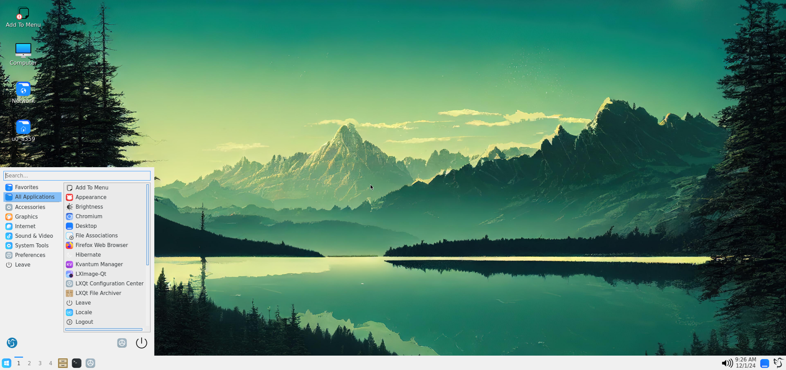
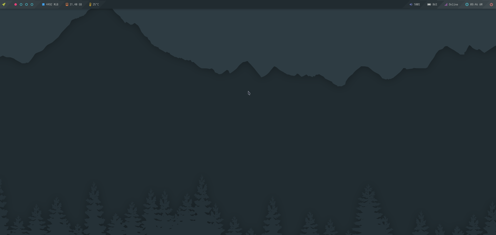
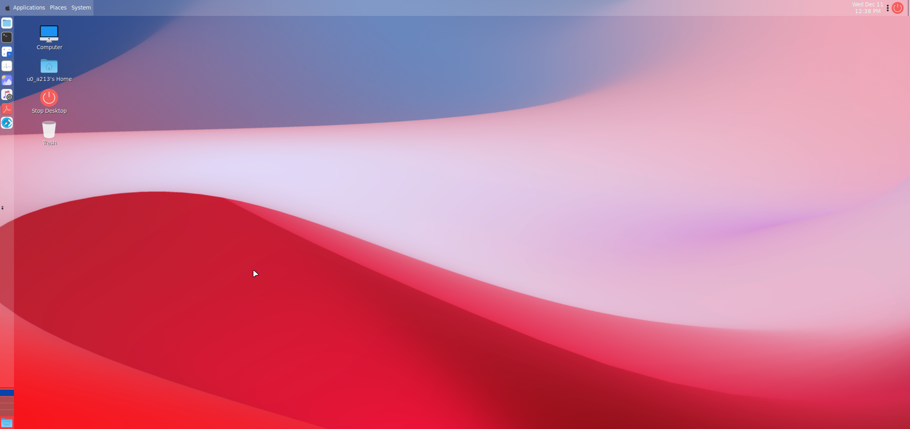

<br>
<center></center>
<br>

<p align="center"><b style="font-size: x-large">Easily Install Termux GUI Desktop</b></p>

<div align="center">

    

</div>

---

## Key Features:

- :books: **Quick Setup:** Easy-to-follow installation process.
- :desktop_computer: **Desktop Styles:** Supports **XFCE**, **LXQt**, and **OPENBOX** with beautiful themes.
- :wine_glass: **Windows App Support:** Run Windows apps using Wine (x86_64 on ARM64 devices).
- :mechanical_arm: **Hardware Acceleration:** Enhances performance for supported hardware.
- :paperclips: **GUI Access:** Supports Termux:X11 and VNC.
- :package: **Package Management:** Compatible with both APT and [PACMAN](https://youtu.be/ditNvG5Nxj0).
- :jigsaw: **One-Click App Installation:**
  - Browsers: Firefox, Chromium
  - Code Editors: VS Code, Geany
  - Image Editors: GIMP, Inkscape
  - And more...
- :package: **Additional Apps:** Install apps like LibreOffice not available by default in Termux.
- :art: **Customizations:** Extensive configuration options to suit user preferences.

---

## Getting Started:

##### 1. Ensure Requirements Are Met:
   - Android 8+ device
   - [Termux](https://termux.dev/en/) (download from [GitHub](https://github.com/termux/termux-app/releases) or [F-Droid](https://f-droid.org/en/packages/com.termux/))
      >NOTE: This Only Works On Termux From Github Or Fdroid

     > Avoid using Termux from Google Play due to API limitations.
   - Minimum 2GB of RAM (3GB recommended)
   - 1.5-2GB of Internet data
   - 3-4GB of free storage
   - VNC Client ([RealVNC](https://play.google.com/store/apps/details?id=com.realvnc.viewer.android) or [NetHunter Kex](https://store.nethunter.com/en/packages/com.offsec.nethunter.kex/))
   - [Termux:X11](https://github.com/termux/termux-x11/releases)
   - [Termux-API](https://github.com/termux/termux-api/releases) (Openbox only)

##### 2. Explore Desktop Styles:
   - **[XFCE](xfce_styles.md)**
   - **[LXQt](lxqt_styles.md)**
   - **[OPENBOX](openbox_styles.md)**
   - **[MATE](mate_styles.md)**

##### 3. Hardware Acceleration and Distro Container:
   - Learn more about [hardware acceleration](hw-acceleration.md).
   - Check out [distro container usage](proot-caontainer.md).

##### 4. View Supported Apps:
   - Full list available [here](applist.md).

##### 5. Start Installation: 
> Full Installation YouTube Video Guide:- [Here](https://youtu.be/SlR9f9hl5CQ?si=7O13ZAzdAnB_wwWw)

> **Note:** Fresh installations are recommended for best results.

> **Note:** If you are in android 12 or higher then first disable *Phantom Process Killer* **Guide:-** [Here](https://github.com/atamshkai/Phantom-Process-Killer)
   ```bash
   curl -Lf https://raw.githubusercontent.com/sabamdarif/termux-desktop/main/setup-termux-desktop -o setup-termux-desktop && chmod +x setup-termux-desktop && ./setup-termux-desktop
   ```

##### 6. Usage Instructions:
   - Commands for starting and stopping Termux:X11 and VNC sessions are provided below.

---

## Command Reference:

### Start Termux:X11
```bash
tx11start [options]
```
Options:
- `--nogpu`: Disable GPU acceleration.
- `--legacy`: Enable legacy drawing.
- `--nodbus`: Disable DBus.
- Combine options for specific configurations (e.g., `tx11start --nogpu --legacy`).
- `--help`: To show help.

<details>
<summary>Example:</summary>

- `tx11start` *to star Termux:11 with gpu acceleration*
- `tx11start --nogpu` *to star Termux:11 without gpu acceleration*
- `tx11start --nogpu --legacy` *to star Termux:11 without gpu acceleration and _-legacy-drawing_*
- `tx11start --nodbus` *to star Termux:11 without dbus*
- `tx11start --nodbus --nogpu` *to star Termux:11 without gpu acceleration and dbus*
- `tx11start --nodbus --nogpu --legacy` *to star Termux:11 without gpu acceleration and dbus and with _-legacy-drawing_*
- `tx11start --nodbus --legacy` *to star Termux:11 without dbus and use _-legacy-drawing_ (nodbus and gpu)*
- `tx11start --legacy` *to star Termux:11 with _-legacy-drawing_ (with dbus and gpu)*
- `tx11start --debug --OTHER-PARAMETERS` *To see log of that commmand*
  >tx11start --debug --nogpu *To See tx11start --nogpu's log*

</details>

### Stop Termux:X11
```bash
tx11stop [-f]
```
Options:
- `-f`: Force stop.
- `--help`: To show help.

### Start VNC
```bash
vncstart [options]
```
Options:
- `--nogpu`: Disable GPU acceleration.
- `--help`: To show help.

### Stop VNC
```bash
vncstop [-f]
```
Options:
- `-f`: Force stop.
- `--help`: To show help.

### GUI Commands
```bash
gui [options]
```
Options:
- `--start`: Start GUI (use `vnc` or `tx11` as arguments).
- `--stop`: Stop GUI.
- `--kill`: Stop all GUI sessions.
- `--help`: To show help.

<details>
<summary>Example:</summary>

##### If you select only one of them to access gui
- `gui --start / gui -l` *to start Termux gui*
- `gui --stop / gui -s` *to stop gui*

##### If you select both for gui access
- `gui -l / --start` `vnc` *to start VNC*
- `gui -l / --start` `tx11` *to start Termux:X11*
- `gui -s / --stop` `vnc` *to stop VNC*
- `gui -s / --stop` `tx11` *to stop Termux:X11*
- `gui -k / --kill / -kill` *to kill both vncserver and Termux:x11 At Once*

</details>

### Setup Commands
```bash
setup-termux-desktop [options]
```
Options:
- `--change style`: Change desktop style.
- `--change hw`: Modify hardware acceleration settings.
- `--reset`: Reset all changes.
- `--remove`: Uninstall Termux Desktop.
- `--help`: To show help.

<details>
<summary>Example:</summary>

- `setup-termux-desktop --change style` *To Change Desktop Style*
- `setup-termux-desktop --change hw` *To Change Hardware Acceleration Method*
- `setup-termux-desktop --change pd` *To Change Installed Proot-Distro*
- `setup-termux-desktop --change autostart` *To change autostart behaviour*
- `setup-termux-desktop --change display` *To change termux:x11 display port*
<br>

- `setup-termux-desktop --reinstall icons / themes /config` *To Reinstall Icons / Themes / Config*
- `setup-termux-desktop --reinstall icons,themes,..etc` *To Reinstall Them At Once*
<br>

- `setup-termux-desktop --reset` *To Reset All Changes Made By This Script Without Uninstalling The Packages*
<br>

- `setup-termux-desktop --remove / -r` *To Remove Termux Desktop*
<br>

- `setup-termux-desktop --debug` **(At The Start)** *To generate a log file for any of the above command*

  - `setup-termux-desktop --debug --install` *To create a log of whole installation process*

</details>

---

## Screenshots:

### Demo Looks

|XFCE|LXQT|
|--|--|
|||
|OPENBOX|MATE|
|||

### Supported Apps:- [Here](applist.md)
---

## Advanced Topics:

### Wine:
Run Windows applications seamlessly. Learn more [here](https://github.com/sabamdarif/termux-desktop/blob/main/wine.md#wine_glasslearn-about-wine).

### Distro Containers:
Install additional apps like LibreOffice. Details [here](proot-caontainer.md).

### Hardware Acceleration:
Enhance performance with GPU acceleration. Learn more [here](hw-acceleration.md).

---

## Acknowledgments:
Special thanks to:
- [LinuxDroidMaster/Termux-Desktops](https://github.com/LinuxDroidMaster/Termux-Desktops)
- [phoenixbyrd/Termux_XFCE](https://github.com/phoenixbyrd/Termux_XFCE)
- [Yisus7u7/termux-desktop-xfce](https://github.com/Yisus7u7/termux-desktop-xfce)
- [adi1090x/termux-desktop](https://github.com/adi1090x/termux-desktop)
- [Generator/termux-motd](https://github.com/Generator/termux-motd)
- [virgl-angle-termux](https://github.com/ar37-rs/virgl-angle-termux)
- [myTermux](https://github.com/mayTermux/myTermux)
---

**If you enjoy this project, consider giving it a star!** :star2:

Join the conversation: [Telegram Chat](https://t.me/hello_android_0).